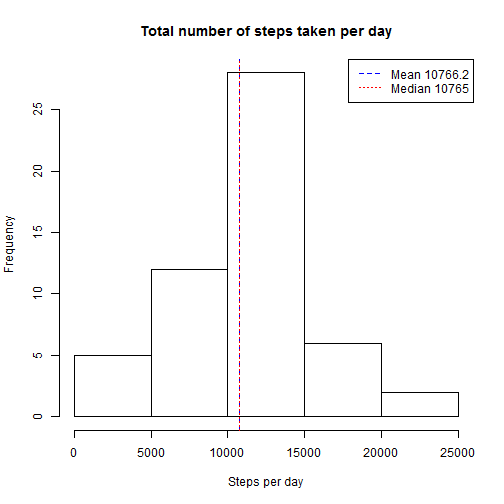
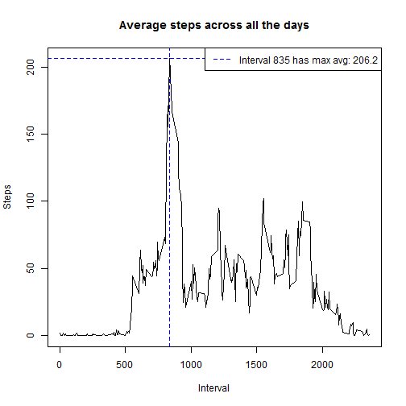
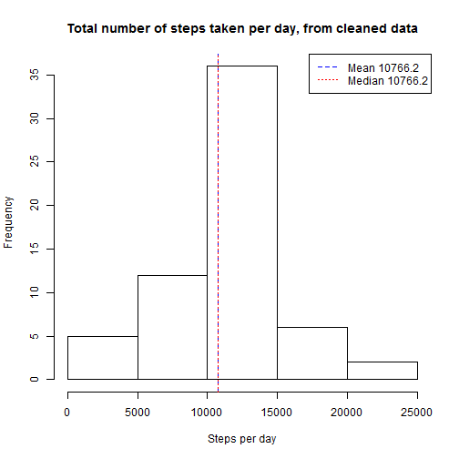
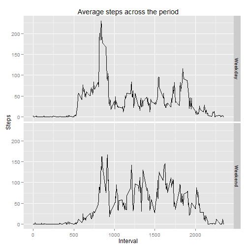

This is Peer Assesment 1 for Coursera course Reproducible Research.

## Setting locale and loading required libraries

Set locale and load libraries


```r
Sys.setlocale("LC_TIME", "English")
```

```
## [1] "English_United States.1252"
```

```r
library(ggplot2)
```

## Loading and preprocessing the data

Lets load the data from activity.csv contained by activity.zip. 

- File activity.zip must be found from working directory. 
  It is extracted if necessary. The original zip file can be found from 
  https://d396qusza40orc.cloudfront.net/repdata%2Fdata%2Factivity.zip
  
- data is loaded from activity.csv

- column date is transformed to Date data type


```r
if( !file.exists("activity.csv")) {
  unzip("activity.zip")
}
data <- read.csv("activity.csv", stringsAsFactors=FALSE)
data$date <- as.Date(data$date, "%Y-%m-%d")
```

Summary of the data


```r
summary(data)
```

```
##      steps             date               interval     
##  Min.   :  0.00   Min.   :2012-10-01   Min.   :   0.0  
##  1st Qu.:  0.00   1st Qu.:2012-10-16   1st Qu.: 588.8  
##  Median :  0.00   Median :2012-10-31   Median :1177.5  
##  Mean   : 37.38   Mean   :2012-10-31   Mean   :1177.5  
##  3rd Qu.: 12.00   3rd Qu.:2012-11-15   3rd Qu.:1766.2  
##  Max.   :806.00   Max.   :2012-11-30   Max.   :2355.0  
##  NA's   :2304
```

## What is mean total number of steps taken per day?

Calculate steps per day, with mean and median values.


```r
stepsperday <- aggregate(data$steps, by=list(date=data$date), FUN=sum)
mea <- mean(stepsperday$x, na.rm=TRUE)
med <- median(stepsperday$x, na.rm=TRUE)
totalsteps <- sum(data$steps, na.rm=TRUE)
```

Histogram presents frequency of steps, along with mean and median.


```r
hist(stepsperday$x, 
     xlab="Steps per day", 
     main="Total number of steps taken per day")
abline(v = mea, col = "blue", lwd = 1, lty=2)
abline(v = med, col = "red", lwd = 1, lty=3)
legend("topright", 
       col=c("blue", "red"),
       legend=c(paste("Mean", round(mea,1)), paste("Median", round(med,1))), 
       lty=c(2,3))
```

 

## What is the average daily activity pattern?

In the data, days have been divided into 5 minute slots called intervals. 
Lets calculate mean of steps for each interval and resolve which interval has 
the highest average value.


```r
intervalstepmeans <- aggregate(data$steps, 
                               by=list(interval=data$interval), 
                               FUN=mean, 
                               na.rm=TRUE)
maxsteps <- max(intervalstepmeans$x)
maxinterval <- intervalstepmeans[order(intervalstepmeans$x,
                                       decreasing=T),]$interval[1]
```

Plot presents the data by using the 5-minute interval as x-axis and the 
average numberof steps taken (averaged across all days) as y-axis. Visualize 
interval with highest average.


```r
plot(intervalstepmeans$x ~ intervalstepmeans$interval, 
     type="n",
     xlab="Interval", 
     ylab="Steps",
     main="Average steps across all the days")

abline(v = maxinterval, h=maxsteps, col = "blue", lwd = 1, lty=2)

lines(intervalstepmeans$x ~ intervalstepmeans$interval, type="l")

legend("topright", 
       col=c("blue"),
       legend=paste("Interval", maxinterval, 
                    "has max avg:", round(maxsteps,1)),
       lty=2,
       bg="white")
```

 

## Imputing missing values

There are a number of days/intervals where there are missing values (coded 
as NA in the data). The presence of missing days may introduce bias into 
some calculations or summaries of the data. The amount of NA values in the
original data is 2304.

Lets create a new dataset that is equal to the original dataset but with 
the missing data filled in. Strategy for replacing the missing 5-minute 
measurements is using a mean value of the corresponding interval. 


```r
cleandata <- data
cleandata$defaultvalue <- intervalstepmeans$x
cleandata$steps <- ifelse(is.na(cleandata$steps), 
                          cleandata$defaultvalue, 
                          cleandata$steps)
```
Summary of the cleaned data


```r
summary(cleandata)
```

```
##      steps             date               interval       defaultvalue    
##  Min.   :  0.00   Min.   :2012-10-01   Min.   :   0.0   Min.   :  0.000  
##  1st Qu.:  0.00   1st Qu.:2012-10-16   1st Qu.: 588.8   1st Qu.:  2.486  
##  Median :  0.00   Median :2012-10-31   Median :1177.5   Median : 34.113  
##  Mean   : 37.38   Mean   :2012-10-31   Mean   :1177.5   Mean   : 37.383  
##  3rd Qu.: 27.00   3rd Qu.:2012-11-15   3rd Qu.:1766.2   3rd Qu.: 52.835  
##  Max.   :806.00   Max.   :2012-11-30   Max.   :2355.0   Max.   :206.170
```

Lets calculate steps per day, with mean and median values again, 
now by using the cleaned data


```r
cleanstepsperday <- aggregate(cleandata$steps,
                              by=list(date=cleandata$date), 
                              FUN=sum)
cleanmea <- mean(cleanstepsperday$x)
cleanmed <- median(cleanstepsperday$x)
cleantotalsteps <- sum(cleandata$steps)
```

Histogram presents frequency of steps, along with mean and median by using 
the cleaned data.


```r
hist(cleanstepsperday$x, 
     xlab="Steps per day", 
     main="Total number of steps taken per day, from cleaned data")
abline(v = cleanmea, col = "blue", lwd = 1, lty=2)
abline(v = cleanmed, col = "red", lwd = 1, lty=3)
legend("topright", 
       col=c("blue", "red"),
       legend=c(paste("Mean", round(cleanmea,1)), 
                paste("Median", round(cleanmed,1))), 
       lty=c(2,3))
```

 

Effects of cleaning the data:

- Mean has changed from 10766.19 to 
  10766.19
- Median has changed from 10765 to 
  10766.19
- Total number of steps has changed from 570608 to 
  656737.5
- As we can see from the results, there are now more days falling in 
  10000-15000 steps category than in the histogram about the original 
  data, but other categories seem to have same frequences. This is 
  caused by the fact that most missing values focused on the same days. 
  Now data for these days has been filled with median data and the appear 
  in the average. For the same reason, they have no effect on mean and 
  very small effect on median.


## Are there differences in activity patterns between weekdays and weekends?

Lets create a new factor variable in the dataset with two levels:
"weekday" and "weekend" indicating whether a given date is a weekday 
or weekend day. Then, lets calculate means for intervals over weekdays 
and weekends.


```r
cleandata$day <- weekdays(cleandata$date)
cleandata$weekpart <- sapply(cleandata$day, function(x) { 
    if(x %in% c("Monday", "Tuesday", "Wednesday", 
                "Thursday", "Friday") ) "Weekday" 
    else "Weekend"
  })

cleanintervalstepmeans <- aggregate(cleandata$steps, 
                                    by=list(interval=cleandata$interval, 
                                            weekpart=cleandata$weekpart), 
                                    FUN=mean)
```

Plot below contains a time series plot of the 5-minute interval (x-axis) 
and the average number of steps taken, averaged across all weekday days 
or weekend days (y-axis). Some variance in the activity pattern can be noticed.


```r
qplot(interval, 
      x, 
      geom="line",
      data=cleanintervalstepmeans, 
      facets = weekpart ~ ., 
      main="Average steps across the period", 
      xlab="Interval", 
      ylab="Steps")
```

 
